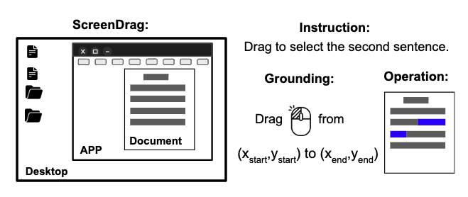

# Beyond Clicking: A Step Towards Generalist GUI Grounding via Text Dragging

> Graphical user interface (GUI) grounding, the process of mapping human instructions to GUI actions, serves as a fundamental basis to autonomous GUI agents. While existing grounding models achieve promising performance to simulate the mouse click action on various click-based benchmarks, another essential mode of mouse interaction, namely dragging, remains largely underexplored. Yet, dragging the mouse to select and manipulate textual content represents a prevalent and important usage in practical GUI scenarios. To narrow this gap, we first introduce \textsc{GUI-Drag}, a diverse dataset of 161K text dragging examples synthesized through a scalable pipeline. To support systematic and robust evaluation, we further construct \textsc{ScreenDrag}, a benchmark with 5,333 examples spanning three levels of interface context, together with three dedicated metrics designed for assessing text dragging capability. Models trained on \textsc{GUI-Drag} with an efficient continual training strategy achieve substantial improvements on \textsc{ScreenDrag}, while preserving the original click-based performance on ScreenSpot, ScreenSpot-v2, and OSWorld-G. Our work encourages further research on broader GUI grounding beyond just clicking and paves way toward a truly generalist GUI grounding model.

## Setup

- Python 3.12
- `pip install -r requirement.txt`

## Experiments

1. Unzip the `image_and_ocr.zip` in the root folder, which contains the examples of the ScreenDrag benchmark and OCR results used during evaluation.

2. Follow the commands in `evaluation/cli_run_drag.sh`. It supports the models containing `GUI-Drag-3/7B (via vllm)`, `Claude computer use`, `OpenAI computer use` and `UI-Tars`.

3. Calculate the metrics of the Success Rate and B-Dist via `metrics/cli_run_drag_metric_new.sh`. It will first output the metric results and summarize the model performance in a report with different breakdowns.

### Credentials

| Backend | Required environment variables |
| --- | --- |
| Claude CUA | `AWS_REGION`, `AWS_ACCESS_KEY`, `AWS_SECRET_KEY` (for Bedrock access) |
| OpenAI Operator | `OPENAI_API_KEY` |

## Datasets and Models

`GUI-Drag` dataset can be downloaded at [here](https://huggingface.co/datasets/osunlp/GUI-Drag-dataset).

`GUI-Drag-3/7B` models, which are trained via efficient continual training, can be accessed at [here](https://huggingface.co/osunlp/GUI-Drag-7B).

## Benchmarks

The `ScreenDrag` benchmark can be found in the `benchmark.json` file. Note that you should first unzip the `image_and_ocr.zip` file to support the evaluation.

## Citations

If you find our data, model, benchmark or the general resources useful, please consider citing us via:

TODO
